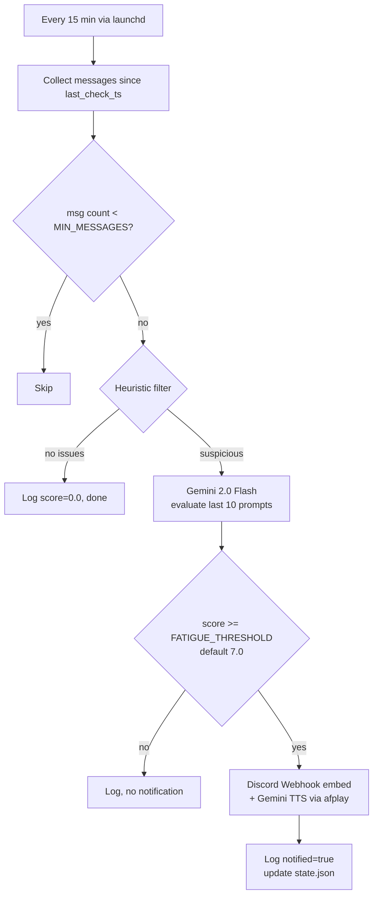

# fatigue-monitor

Watches your [Claude Code](https://claude.ai/code) and [Codex CLI](https://github.com/openai/codex) conversation history, detects when you're getting tired, and sends you a voice + Discord alert before you ship something you'll regret.

[日本語 README](README.md)

## How it works

Every 15 minutes a launchd background job reads the JSONL conversation logs and runs a two-stage check:



### Stage 1 – Heuristic filter

Skips the LLM call entirely if none of these conditions are met (saves API cost):

| Condition | Default threshold | What it detects |
|-----------|-------------------|-----------------|
| Prompt length drop | ≥ 30% shorter in 2nd half | Getting terse / losing focus |
| Session duration | ≥ 180 min elapsed | Working too long without a break |
| Late-night hours | 22:00 – 5:00 | Burning midnight oil |

If at least one condition is met, proceeds to Stage 2.

### Stage 2 – Gemini 2.0 Flash evaluation

Sends the last 10 prompts (truncated to 300 chars each) plus session stats to `gemini-2.0-flash` and receives a fatigue score (0.0–10.0) and reason in JSON.

### Stage 3 – Alerts (score ≥ 7.0)

- **Discord Webhook** – rich embed with score, reason, and session stats
- **Voice alert** – Japanese TTS via Gemini TTS API, played with macOS `afplay` (no ffmpeg needed)

### Conversation sources

| Source | Location |
|--------|----------|
| Claude Code | `~/.claude/projects/**/*.jsonl` |
| Codex CLI | `~/.codex/history.jsonl` |

Shell commands (lines starting with `!`) and `[Request interrupted by user]` entries are excluded from analysis.

> For a detailed breakdown of the heuristic conditions and Gemini API payload, see [docs/detection-logic.md](docs/detection-logic.md).

---

## Requirements

- macOS (uses `launchd` for scheduling, `afplay` for audio)
- [uv](https://docs.astral.sh/uv/) – no other Python setup needed
- Gemini API key ([get one](https://aistudio.google.com/app/apikey))
- Discord Webhook URL (Server Settings → Integrations → Webhooks)

---

## Installation

```bash
# 1. Clone
git clone https://github.com/noricha-vr/fatigue-monitor.git
cd fatigue-monitor

# 2. Set up environment variables
cp -n .env.example ~/.env   # -n: do not overwrite if ~/.env already exists
# Or append only the new keys:
# cat .env.example >> ~/.env
# Edit ~/.env and fill in GEMINI_API_KEY and DISCORD_WEBHOOK_URL

# 3. Install launchd agent (runs every 15 minutes)
bash install.sh
```

`install.sh` will:
- Generate a plist at `~/Library/LaunchAgents/com.<username>.fatigue-monitor.plist`
- Create the log directory at `~/.local/share/fatigue-monitor/`
- Load the agent immediately (no reboot needed)

---

## Manual usage

```bash
# Incremental check (since last run)
uv run --script check.py

# Delete state.json and re-evaluate all history
uv run --script check.py --reset
```

> **Note**: `--dry-run` is not yet implemented. To test without real notifications, temporarily set an invalid webhook URL.

---

## Configuration

Default values are defined as constants in `check.py`. To change them, edit the file directly:

| Constant | Default | Description |
|----------|---------|-------------|
| `FATIGUE_THRESHOLD` | `7.0` | Score threshold for sending alerts (0–10) |
| `MIN_MESSAGES` | `3` | Minimum messages required before evaluating |
| `PROMPT_LENGTH_DROP_RATIO` | `0.3` | Drop ratio (30%) to trigger LLM evaluation |
| `SESSION_LONG_MIN` | `180` | Session duration in minutes to trigger LLM |
| `LATE_NIGHT_HOUR_START` | `22` | Late-night period start (24h) |
| `LATE_NIGHT_HOUR_END` | `5` | Late-night period end (24h) |

Required environment variables (read from `~/.env`):

| Variable | Description |
|----------|-------------|
| `GEMINI_API_KEY` | **Required.** Used for both LLM evaluation and TTS |
| `DISCORD_WEBHOOK_URL` | **Required.** Must start with `https://discord.com/api/webhooks/` |

---

## What you'll receive

### Discord embed

When the fatigue score reaches the threshold, you'll get a Discord message like this:

| Field | Example |
|-------|---------|
| Title | 🔔 Fatigue Alert (score: 7.5 / 10) |
| Description | **prompts getting shorter and vague** · Time to take a break! |
| Messages | 39 |
| Avg prompt length | 3550 chars |
| Session duration | 8 min |
| Late night | no |
| Tools | claude-code |
| Color | #FF6B35 (orange) |

### Voice alert (macOS)

A Japanese TTS message is played via `afplay`:

> 疲労スコア7です。プロンプトが短く曖昧化。少し休憩してみてはいかがでしょうか？

- Model: `gemini-2.5-flash-preview-tts`
- Voice: Kore (Japanese)
- No ffmpeg required – uses Python's `wave` module for PCM→WAV conversion

---

## Data & privacy

Conversation history stays on your machine. Only the **last 10 prompts** (truncated to 300 chars each) plus aggregate stats are sent to the Gemini API.

| File | Path |
|------|------|
| State (last check timestamp) | `~/.local/share/fatigue-monitor/state.json` |
| Evaluation log | `~/.local/share/fatigue-monitor/log.jsonl` |
| Daemon stdout/stderr | `~/.local/share/fatigue-monitor/fatigue-monitor.log` |

### log.jsonl format

Each run appends one JSON line:

```json
// Alert triggered
{"ts": "2026-02-27T01:49:58.554215+00:00", "score": 7.5, "reason": "prompts getting shorter and vague", "stats": {"message_count": 39, "avg_prompt_length": 3550, "prompt_length_drop_ratio": 0.4, "session_duration_min": 8, "is_late_night": false, "sources": ["claude-code"]}, "notified": true}

// Heuristic passed – no LLM call made
{"ts": "2026-02-27T02:06:27.279728+00:00", "score": 0.0, "reason": "heuristic: no issue", "stats": {"message_count": 32, "avg_prompt_length": 1200, "prompt_length_drop_ratio": 0.1, "session_duration_min": 5, "is_late_night": false, "sources": ["claude-code"]}, "notified": false}
```

---

## Troubleshooting

**No Discord notification received**
- Check `log.jsonl` – if `notified: false`, the score was below the threshold.
- Verify `DISCORD_WEBHOOK_URL` in `~/.env` starts with `https://discord.com/api/webhooks/`.
- Run `uv run --script check.py` manually and watch the output.

**`GEMINI_API_KEY` error on startup**
- The script exits immediately with a `RuntimeError` if the key is missing. Check `~/.env`.

**No voice alert**
- Audio playback uses macOS `afplay`. Not supported on Linux/Windows.
- Check `~/.local/share/fatigue-monitor/fatigue-monitor.log` for TTS errors.

**Want to force re-evaluation of all history**
- Run `uv run --script check.py --reset` to delete `state.json` and re-process everything.

**Check if the daemon is running**
```bash
launchctl list | grep fatigue
tail -f ~/.local/share/fatigue-monitor/fatigue-monitor.log
```

---

## Uninstall

```bash
launchctl unload ~/Library/LaunchAgents/com.$(whoami).fatigue-monitor.plist
rm ~/Library/LaunchAgents/com.$(whoami).fatigue-monitor.plist
```

---

## License

MIT
