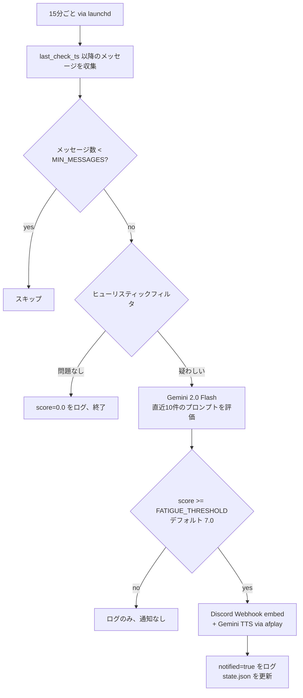

# fatigue-monitor

[Claude Code](https://claude.ai/code) と [Codex CLI](https://github.com/openai/codex) の会話ログを監視し、疲れのサインを検知したら音声 + Discord で通知するツール。後悔するコードをデプロイする前に休憩を促してくれる。

[English README](README.en.md)

## 仕組み

15 分ごとに launchd バックグラウンドジョブが JSONL 会話ログを読み込み、2 段階チェックを実行する:



### Stage 1 – ヒューリスティックフィルタ

以下の条件をいずれも満たさない場合は LLM 呼び出しをスキップ（API コスト削減）:

| 条件 | デフォルト閾値 | 検出対象 |
|------|--------------|---------|
| プロンプト長のドロップ | 後半が 30% 以上短縮 | 集中力低下・内容が雑になる |
| セッション継続時間 | 180 分以上 | 休憩なしの長時間作業 |
| 深夜帯 | 22:00 〜 5:00 | 夜更かし |

いずれか 1 つでも該当すれば Stage 2 へ進む。

### Stage 2 – Gemini 2.0 Flash 評価

直近 10 件のプロンプト（各 300 文字にトランケート）とセッション統計を `gemini-2.0-flash` に送信し、疲労スコア（0.0〜10.0）と理由を JSON で受け取る。

### Stage 3 – アラート（score ≥ 7.0）

- **Discord Webhook** – スコア・理由・セッション統計を含むリッチ embed
- **音声アラート** – Gemini TTS API による日本語 TTS を macOS `afplay` で再生（ffmpeg 不要）

### 会話ログの収集元

| ソース | パス |
|--------|------|
| Claude Code | `~/.claude/projects/**/*.jsonl` |
| Codex CLI | `~/.codex/history.jsonl` |

`!` で始まるシェルコマンドと `[Request interrupted by user]` は分析から除外される。

> ヒューリスティック条件と Gemini API ペイロードの詳細は [docs/detection-logic.md](docs/detection-logic.md) を参照。

---

## 必要なもの

- macOS（スケジューリングに `launchd`、音声再生に `afplay` を使用）
- [uv](https://docs.astral.sh/uv/) – 他の Python セットアップ不要
- Gemini API キー（[取得はこちら](https://aistudio.google.com/app/apikey)）
- Discord Webhook URL（サーバー設定 → 連携サービス → ウェブフック）

---

## インストール

```bash
# 1. Clone
git clone https://github.com/noricha-vr/fatigue-monitor.git
cd fatigue-monitor

# 2. 環境変数の設定
cp -n .env.example ~/.env   # -n: ~/.env が既存の場合は上書きしない
# または必要なキーだけ追記:
# cat .env.example >> ~/.env
# ~/.env を編集して GEMINI_API_KEY と DISCORD_WEBHOOK_URL を設定する

# 3. launchd エージェントのインストール（15 分ごとに実行）
bash install.sh
```

`install.sh` の動作:
- `~/Library/LaunchAgents/com.<username>.fatigue-monitor.plist` を生成
- `~/.local/share/fatigue-monitor/` にログディレクトリを作成
- エージェントを即時ロード（再起動不要）

---

## 手動実行

```bash
# 増分チェック（前回実行以降分）
uv run --script check.py

# 全履歴を再評価（state.json を削除してリセット）
uv run --script check.py --reset
```

> **注意**: `--dry-run` は未実装。通知なしでテストするには、一時的に無効な Webhook URL を設定する。

---

## 設定

デフォルト値は `check.py` の定数として定義されている。変更はファイルを直接編集するか、`~/.env` で環境変数を設定する:

| 定数 / 環境変数 | デフォルト | 説明 |
|---------------|-----------|------|
| `FATIGUE_THRESHOLD` | `7.0` | アラートを送るスコア閾値（0〜10） |
| `MIN_MESSAGES` | `3` | 評価に必要な最小メッセージ数 |
| `PROMPT_LENGTH_DROP_RATIO` | `0.3` | LLM 評価を起動するドロップ率（30%） |
| `SESSION_LONG_MIN` | `180` | LLM 評価を起動するセッション時間（分） |
| `LATE_NIGHT_HOUR_START` | `22` | 深夜帯の開始時刻（24h） |
| `LATE_NIGHT_HOUR_END` | `5` | 深夜帯の終了時刻（24h） |

`~/.env` に必須の環境変数:

| 変数 | 説明 |
|------|------|
| `GEMINI_API_KEY` | **必須。** LLM 評価と TTS の両方に使用 |
| `DISCORD_WEBHOOK_URL` | **必須。** `https://discord.com/api/webhooks/` で始まること |

---

## 通知の内容

### Discord embed

疲労スコアが閾値に達すると、以下のような Discord メッセージが届く:

| フィールド | 例 |
|-----------|-----|
| タイトル | Fatigue Alert (score: 7.5 / 10) |
| 説明 | **prompts getting shorter and vague** · Time to take a break! |
| Messages | 39 |
| Avg prompt length | 3550 chars |
| Session duration | 8 min |
| Late night | no |
| Tools | claude-code |
| 色 | #FF6B35（オレンジ） |

### 音声アラート（macOS）

`afplay` で事前生成した WAV ファイルが再生される:

> 疲れていませんか？少し休んでみてはいかがでしょうか。

- モデル: `gemini-2.5-pro-preview-tts`
- ボイス: Kore（日本語）
- 音声ファイルは `install.sh` 実行時に一度だけ生成され `~/.local/share/fatigue-monitor/alert.wav` に保存される
- アラート発火時は API 呼び出しなしでローカルファイルを再生
- 音声を再生成したい場合: `uv run --script generate_audio.py`

---

## データとプライバシー

会話履歴はローカルマシンに保存される。Gemini API に送信されるのは**最新 10 件のプロンプト**（各 300 文字にトランケート）と集計統計のみ。

| ファイル | パス |
|---------|------|
| 状態ファイル（最終チェック時刻） | `~/.local/share/fatigue-monitor/state.json` |
| 評価ログ | `~/.local/share/fatigue-monitor/log.jsonl` |
| デーモン stdout/stderr | `~/.local/share/fatigue-monitor/fatigue-monitor.log` |

### log.jsonl のフォーマット

1 回の実行で 1 行追記される:

```json
// アラート発火
{"ts": "2026-02-27T01:49:58.554215+00:00", "score": 7.5, "reason": "prompts getting shorter and vague", "stats": {"message_count": 39, "avg_prompt_length": 3550, "prompt_length_drop_ratio": 0.4, "session_duration_min": 8, "is_late_night": false, "sources": ["claude-code"]}, "notified": true}

// ヒューリスティックを通過 – LLM 呼び出しなし
{"ts": "2026-02-27T02:06:27.279728+00:00", "score": 0.0, "reason": "heuristic: no issue", "stats": {"message_count": 32, "avg_prompt_length": 1200, "prompt_length_drop_ratio": 0.1, "session_duration_min": 5, "is_late_night": false, "sources": ["claude-code"]}, "notified": false}
```

---

## トラブルシューティング

**Discord 通知が届かない**
- `log.jsonl` を確認 – `notified: false` の場合はスコアが閾値未満。
- `~/.env` の `DISCORD_WEBHOOK_URL` が `https://discord.com/api/webhooks/` で始まっているか確認。
- `uv run --script check.py` を手動実行して出力を確認。

**起動時に `GEMINI_API_KEY` エラー**
- キーが未設定の場合、スクリプトは `RuntimeError` で即時終了する。`~/.env` を確認。

**音声アラートが鳴らない**
- macOS の `afplay` を使用しているため Linux/Windows は非対応。
- `~/.local/share/fatigue-monitor/fatigue-monitor.log` で TTS エラーを確認。

**全履歴を強制再評価したい**
- `uv run --script check.py --reset` で `state.json` を削除して再処理。

**デーモンの稼働確認**
```bash
launchctl list | grep fatigue
tail -f ~/.local/share/fatigue-monitor/fatigue-monitor.log
```

---

## アンインストール

```bash
launchctl unload ~/Library/LaunchAgents/com.$(whoami).fatigue-monitor.plist
rm ~/Library/LaunchAgents/com.$(whoami).fatigue-monitor.plist
```

---

## ライセンス

MIT
